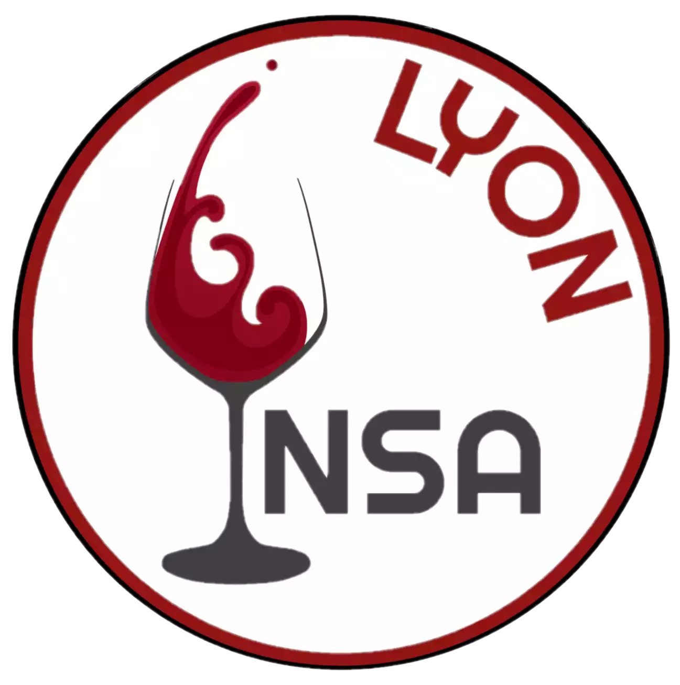

    
    <h1>Club Œnologie de l'INSA Lyon</h1>

[https://oenologieinsalyon.fr](https://oenologieinsalyon.fr)

Ce site est la vitrine officielle du club, il présente ses activités, annonce les événements et met en avant la vie du club à travers des photos et souvenirs.

---

## À propos du club
Le club d'œnologie a pour mission de faire découvrir l'univers fascinant du vin à travers des dégustations ludiques et accessibles. Ouvert à tous les niveaux, des débutants aux connaisseurs.

L'objectif est d'offrir à chacun une expérience enrichissante dans une ambiance conviviale, favorisant le partage et l'apprentissage autour de la culture du vin. Rejoindre le club, c'est participer à des moments gourmands, faire de nouvelles rencontres et éveiller ses sens tout en explorant la diversité des vins.

---

## À propos du site
Le site officiel du club permet de :
- Consulter les **événements passés et à venir**
- Parcourir les **photos des événements passés**
- Découvrir les **photos des concours** auxquels le club a participé

---

## Développement
- **Technologies utilisées** :   
- **Hébergement** : [oenologieinsalyon.fr](https://oenologieinsalyon.fr)

## Contact
- Site web : [oenologieinsalyon.fr](https://oenologieinsalyon.fr)  
- Mail : oenologieinsalyon@gmail.com

---

© Club Œnologie INSA Lyon – 2025